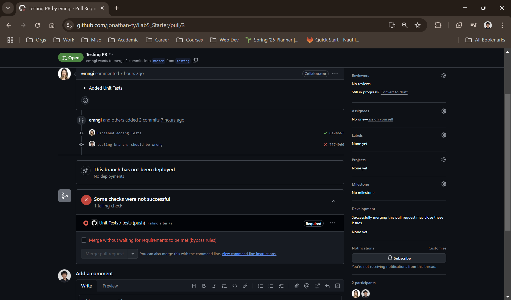
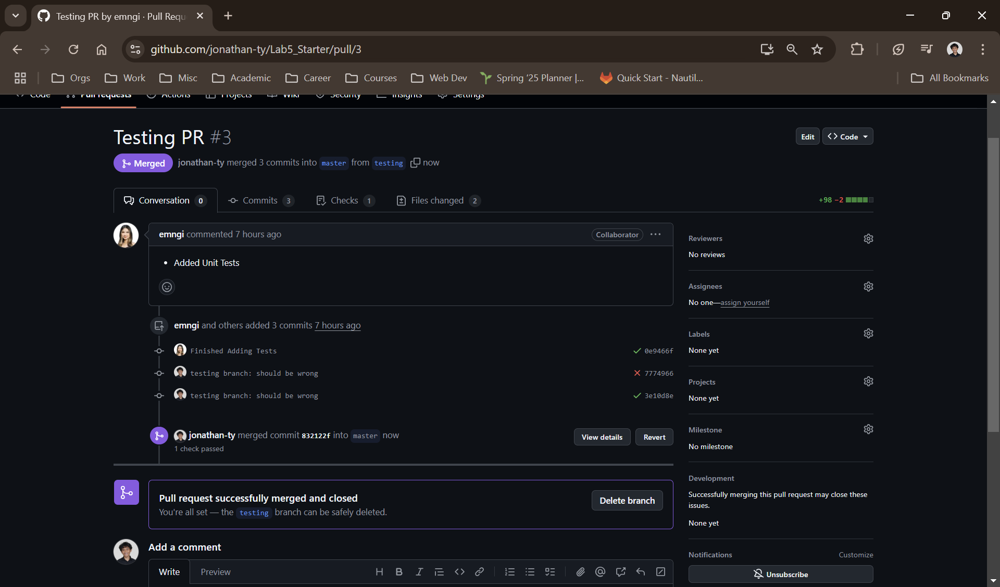

# Lab 5 - Starter

### Team Member(s)

[Emily Nguyen](https://github.com/emngi)\
[Jonathan Ty](https://github.com/jonathan-ty)

Check Understanding:
1. No we would probably not use unit testing to test the messaging feature as a whole since there are many different parts (different functions and actions) that would be difficult to test.
2. Yes, we could use unit testing, as this is a small enough feature to be successfully tested using unit tests. We can most likely isolate and test for the max message length using unit tests. 

[`expose.html` GitHub page](https://jonathan-ty.github.io/Lab5_Starter/expose.html)\
[`explore.html` GitHub page](https://jonathan-ty.github.io/Lab5_Starter/explore.html)

